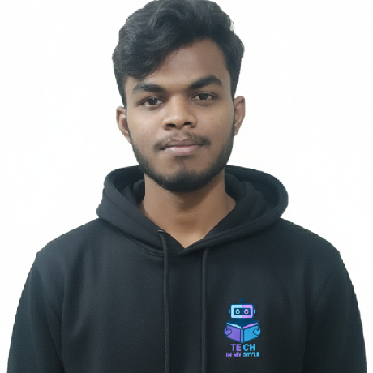

<!-- ================= PROFILE CARD ================= -->

  <table>
    <tr>
      <td align="center" style="padding:20px">
        
      </td>
      <td style="padding:20px">
        <h1>Rama Krishna Prasad</h1>
        <h3>
          MERN Stack Developer • No-Code AI Developer • WordPress Developer • 
          UI/UX Designer <b>IN</b> 
          
        </h3>
        
          
        
      </td>
    </tr>
  </table>

---

## 👨‍💻 About Me

I’m a **final-year B.Tech student** and a passionate technologist working at the intersection of:

- ⚡ MERN Stack Development  
- 🤖 No-Code AI & Automation  
- 🌐 WordPress Solutions  
- 🎨 UI/UX Design Systems  

Founder of **Tech In My Style**, a modern learning ecosystem that makes education  
**visual, practical, structured, and industry-ready**.

---

## 🚀 Flagship Platform — Tech In My Style

🌐 **Main Platform:** https://techinmystyle.com  
A next-generation EdTech ecosystem covering Web, Programming & AI.

### 📚 Learning Tracks

<table>
<tr>
<td align="center">🌐 <a href="https://techinmystyle.com/html">HTML</a></td>
<td align="center">🎨 <a href="https://techinmystyle.com/css">CSS</a></td>
<td align="center">⚡ <a href="https://techinmystyle.com/js-basic">JS Basics</a></td>
<td align="center">🚀 <a href="https://techinmystyle.com/js-intermediate">JS Advanced</a></td>
</tr>
<tr>
<td align="center">☕ <a href="https://techinmystyle.com/java">Java</a></td>
<td align="center">💻 <a href="https://techinmystyle.com/c">C</a></td>
<td align="center">🐍 <a href="https://techinmystyle.com/python">Python</a></td>
<td align="center">🤖 <a href="https://techinmystyle.com/ai">AI</a></td>
</tr>
<tr>
<td align="center">📊 <a href="https://techinmystyle.com/ml">ML</a></td>
<td align="center">🧠 <a href="https://techinmystyle.com/dl">DL</a></td>
<td align="center">📈 <a href="https://techinmystyle.com/dsc">Data Science</a></td>
<td></td>
</tr>
</table>

---

## 🧠 Skills (3D Style)

  

---

## 📊 GitHub Performance (Current Year)

  

  

  

  

---

## 🐍 Animated Contribution Snake

  

---

## 🏆 Achievements

  

---

## 🎯 Career Vision

> To become a world-class **Software Engineer & AI Creator** blending  
> **Design, Development, and Intelligence**  
> to build platforms that educate and impact millions.

---

<!-- ================= FOOTER ================= -->

  

