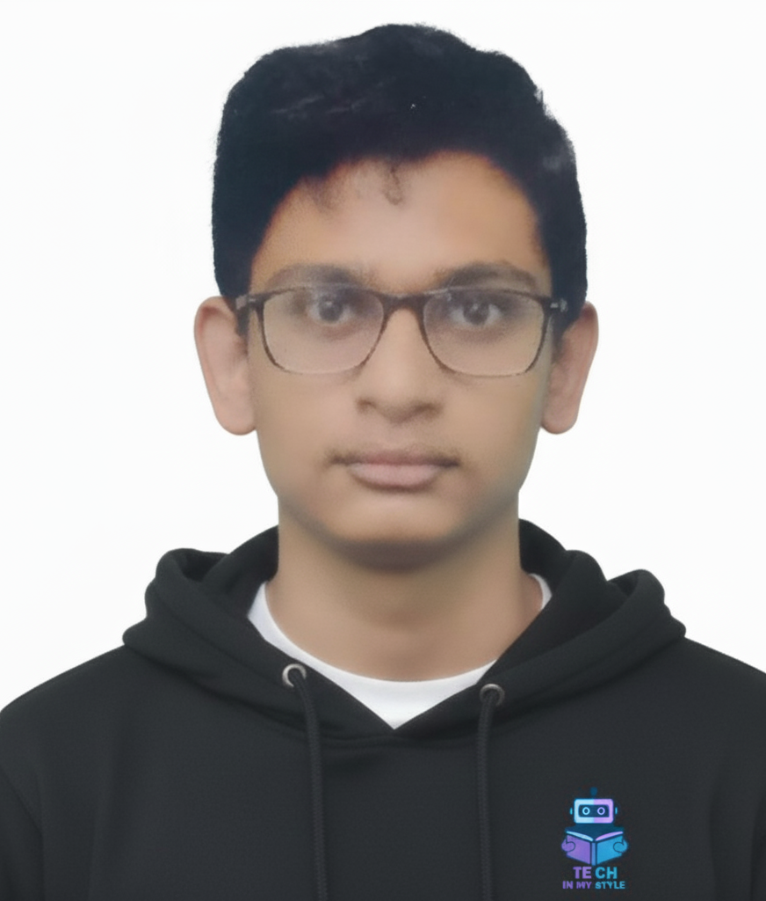

<!-- ===================== ULTRA HEADER ===================== -->
    

  

  MERN Stack Developer &nbsp;•&nbsp; UI/UX Designer &nbsp;•&nbsp; No-Code AI Developer

  

---

  

<h2 align="center">
  I'm Rama Krishna Prasad 🇮🇳
  
</h2>

  

🎓 B.Tech Final Year Student  
💻 Specialized in MERN Stack  
🎨 Complete UI/UX Designer (Figma Focused)  
🧠 Strong in Frontend Architecture  
🎯 Dedicated to structured learning platforms

---

# 🚀 Featured Platform — Tech In My Style

  

  

### 👥 Team Collaboration (3 Members)

  

  

  

### 🎯 My Role

- Full UI/UX Design (Complete platform designed in Figma)
- Frontend Development
- Debugging & Optimization
- Logo Design (All platform logos)
- Certificate Design (All certificates)

---

## 🔥 Courses (Designed & Developed by Me)

  

  

  

  

HTML In My Style • CSS In My Style • JavaScript Basic • JavaScript Intermediate

---

## 🌐 Additional Courses On Platform

  

  

  

  

  

  

C • Java • Python • Machine Learning • Deep Learning • Data Science

---

# 🛠 Technology Stack

  

---

# 📊 GitHub Performance Dashboard

  

---

# 📈 Contribution Activity

  

---

# 🐍 Contribution Snake

  

---

# 🌐 Connect With Me

  

  

  

  

  

---

  

